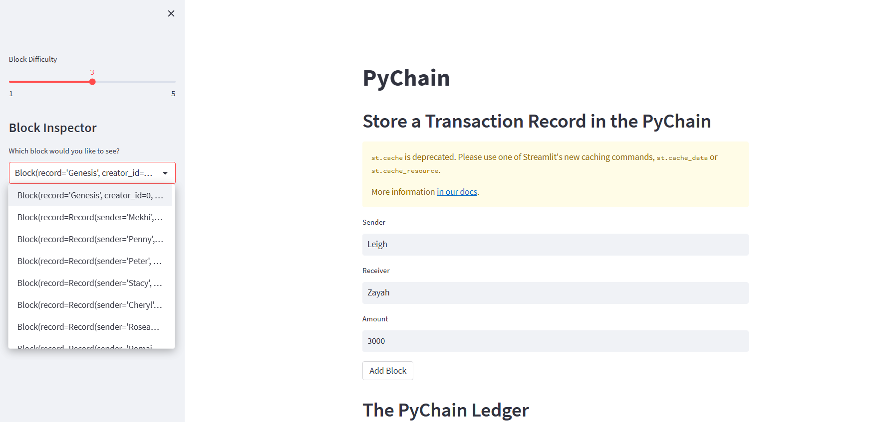

# PyChain Ledger

As a fintech engineer, the task was to build a blockchain-based ledger system with a user-friendly web interface that will allow partner banks to conduct financial transactions and verify the integrity of the data in the ledger. The project involved creating a new data class named Record, replacing the existing generic data attribute with a record attribute of type Record in the Block data class, and creating additional user input areas in the Streamlit application to collect relevant information for each financial record to be stored in the PyChain ledger.

## Technologies
Python 3.7.10
Streamlit 0.84.0

## Streamlit Application
### Step 1: Create a new data class named Record 
The Streamlit application contains input fields for the user to enter the relevant information for each financial transaction record that will be stored in the PyChain ledger. These input fields include:

Sender
Recipient
Amount
Once the user enters the information and clicks on the "Add Block" button, a new block is added to the PyChain ledger, containing the record of the financial transaction.

### Step 2: Modify the existing Block data class to store Record data
record: Record  

### Step 3: Add Relevant User Inputs to the Streamlit interface 
sender = st.text_input("Sender")
receiver = st.text_input("Receiver")
amount = st.text_input("Amount")

### Step 4: Test the PyChain Ledger by Storing Records
For this task, I entered values for the sender, receiver, and amount multiple times to add transactions to the blockchain. After inputting the values, I clicked on the "Validate" button, which resulted in a confirmation that the blockchain was valid (result = True). You can refer to the screenshots below for a visual representation of the process.

## Conclusion
The PyChain ledger system has been successfully built, allowing partner banks to conduct financial transactions and verify the integrity of the data in the ledger. With the user-friendly web interface built using Streamlit, users can easily input the relevant information for each financial transaction, making it easy to store and verify data on the blockchain-based ledger system.
